# HW8 – Pinecone Semantic Search with Apache Airflow

## Project Overview

This project implements a complete semantic search pipeline using Apache Airflow to orchestrate the entire workflow—from data ingestion and text processing to embedding generation and vector search with Pinecone. The entire system runs in Docker containers, demonstrating how to integrate ML-powered search capabilities into a production data pipeline. The workflow downloads text data, chunks it intelligently, generates embeddings using a pre-trained transformer model, stores vectors in Pinecone's serverless database, and performs semantic queries to retrieve relevant results.

## Repository Link

**GitHub Repository:** [https://github.com/Mrnidhi/SJSU_DATA226/tree/main/Week%208](https://github.com/Mrnidhi/SJSU_DATA226/tree/main/Week%208)

---

## Step 1: Configure Docker Environment with Custom Dependencies

To add the necessary libraries for semantic search and Pinecone integration, I started by creating a custom Dockerfile that extends the base Apache Airflow image. This allows me to install additional Python packages needed for text embeddings and vector database operations.

**Custom Dockerfile extending Apache Airflow:**

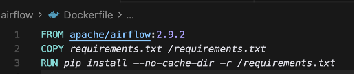

Next, I created a `requirements.txt` file listing all the required libraries including `sentence-transformers` for generating embeddings and `pinecone` for vector database operations.

**Requirements file with all dependencies:**

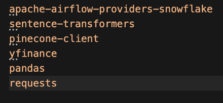

Inside my `docker-compose-celery.yaml`, I replaced the standard image line with a build configuration that points to my custom Dockerfile. This tells Docker to build a new Airflow image using my specifications instead of pulling a pre-built image.

**Docker Compose configuration:**

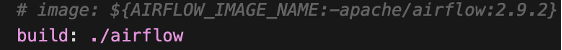

**Build configuration in docker-compose:**

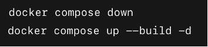

After making these changes, I rebuilt and restarted all the containers to ensure the new packages were installed and available to Airflow:

```bash
docker compose -f docker-compose-celery.yaml build
docker compose -f docker-compose-celery.yaml down
docker compose -f docker-compose-celery.yaml up -d
```

**Container restart and verification:**

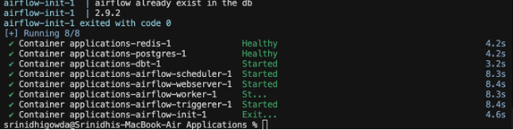

---

## Step 2: Configure Pinecone Credentials in Airflow

I set up a Pinecone account and obtained an API key. In the Airflow UI under Admin → Variables, I created a new variable named `pinecone_cfg` containing all the configuration parameters needed to connect to Pinecone. This approach keeps sensitive credentials secure and makes the pipeline easily configurable without modifying code.

**Airflow Variable JSON configuration:**

```json
{
  "api_key": "your-pinecone-api-key",
  "index_name": "hw8-embeddings",
  "dimension": 384,
  "metric": "cosine",
  "cloud": "aws",
  "region": "us-east-1",
  "top_k": 5
}
```

**Airflow UI Variable creation:**

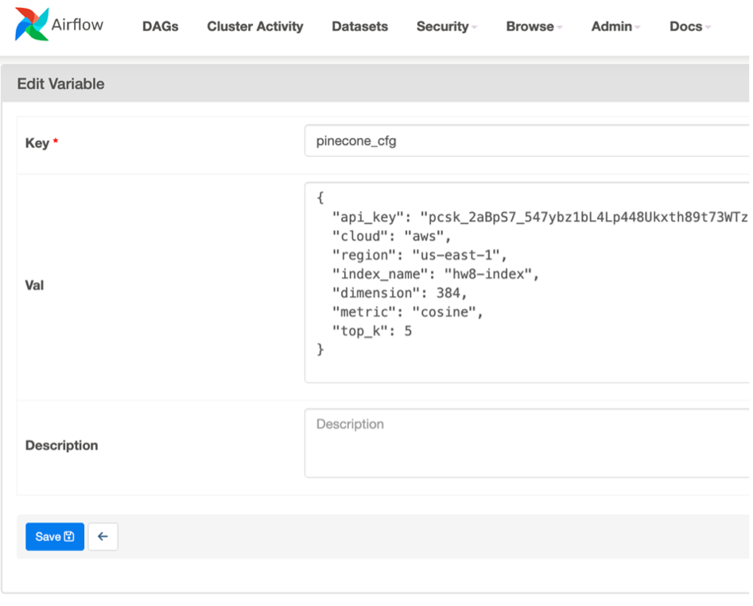

---

## Step 3: Build Input File Task

The first task in my DAG is `build_input_file`, which downloads text from Project Gutenberg (Romeo and Juliet), cleans it by normalizing whitespace, and splits it into overlapping chunks of 1200 characters with 150-character overlap. Each chunk gets a unique ID and is written to a JSONL file for processing.

**Task definition for downloading, cleaning, and chunking text:**

```python
@task
def build_input_file() -> str:
    pathlib.Path("/opt/airflow/data/processed").mkdir(parents=True, exist_ok=True)
    try:
        r = requests.get(INPUT_URL, timeout=20)
        r.raise_for_status()
        text = r.text
        source = INPUT_URL
    except Exception:
        text = LOCAL_FALLBACK_TEXT
        source = "local_fallback"
    
    text = re.sub(r"\s+", " ", text).strip()
    
    chunks = []
    i = 0
    while i < len(text):
        chunk = text[i : i + CHUNK_SIZE]
        if len(chunk) < CHUNK_SIZE * 0.4:
            break
        chunks.append(chunk)
        i += CHUNK_SIZE - OVERLAP
    
    count = 0
    with open(OUTPUT_JSONL, "w", encoding="utf-8") as f:
        for j, chunk in enumerate(chunks):
            rec = {
                "id": str(uuid.uuid4()),
                "text": chunk,
                "metadata": {"source": source, "chunk": j},
            }
            f.write(json.dumps(rec) + "\n")
            count += 1
    
    print(f"Wrote {count} records to {OUTPUT_JSONL}")
    return OUTPUT_JSONL
```

**Build input file task in Airflow:**

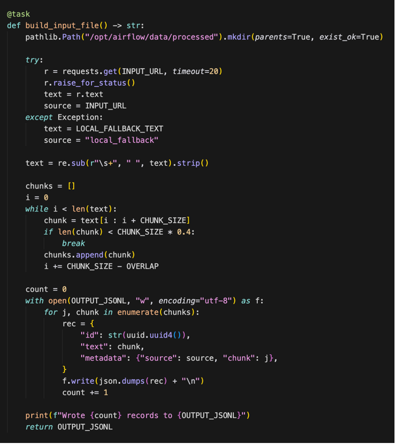

**DAG run logs showing successful execution:**

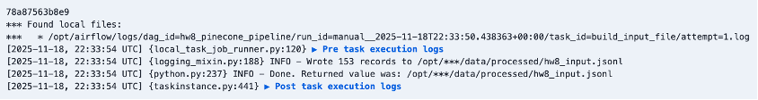

---

## Step 4: Create Pinecone Index Task

The `create_pinecone_index` task idempotently creates a serverless Pinecone index with 384 dimensions (matching the output of the MiniLM embedding model). If the index already exists, the task simply confirms it and continues. This design ensures the pipeline can be run multiple times safely without creating duplicate indexes.

**Task definition for creating Pinecone index:**

```python
@task
def create_pinecone_index():
    cfg = Variable.get("pinecone_cfg", deserialize_json=True)
    pc = Pinecone(api_key=cfg["api_key"])
    index_name = cfg["index_name"]
    existing = [i["name"] for i in pc.list_indexes()]
    if index_name not in existing:
        pc.create_index(
            name=index_name,
            dimension=cfg["dimension"],
            metric=cfg.get("metric", "cosine"),
            spec=ServerlessSpec(
                cloud=cfg.get("cloud", "aws"),
                region=cfg.get("region", "us-east-1")
            ),
        )
        print(f"Created new index: {index_name}")
    else:
        print(f"Index already exists: {index_name}")
    return index_name
```

**Create Pinecone index task:**

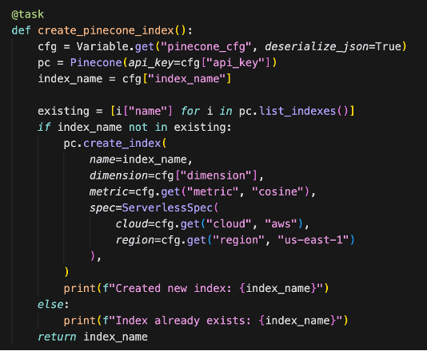

**DAG run logs confirming index creation:**

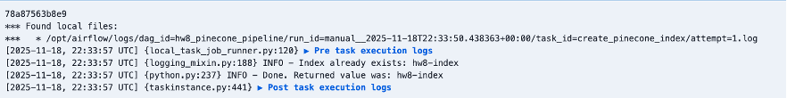

---

## Step 5: Embed and Upsert Task

The `embed_and_upsert` task loads the pre-trained `all-MiniLM-L6-v2` model from Sentence Transformers, reads all text chunks from the JSONL file, and generates 384-dimensional embeddings for each chunk. The vectors are then uploaded to Pinecone in batches of 64 to optimize performance and avoid API rate limits.

**Task definition for embedding generation and upserting:**

```python
@task
def embed_and_upsert(input_jsonl: str):
    cfg = Variable.get("pinecone_cfg", deserialize_json=True)
    pc = Pinecone(api_key=cfg["api_key"])
    index = pc.Index(cfg["index_name"])
    model = SentenceTransformer("sentence-transformers/all-MiniLM-L6-v2")
    
    records = []
    with open(input_jsonl, "r", encoding="utf-8") as f:
        for line in f:
            records.append(json.loads(line))
    
    batch_size = 64
    total = 0
    for i in range(0, len(records), batch_size):
        batch = records[i : i + batch_size]
        texts = [r["text"] for r in batch]
        ids = [r["id"] for r in batch]
        metas = [r.get("metadata", {}) for r in batch]
        embeddings = model.encode(texts, convert_to_numpy=True, show_progress_bar=False)
        vectors = [
            {"id": ids[j], "values": embeddings[j].tolist(), "metadata": metas[j]}
            for j in range(len(batch))
        ]
        index.upsert(vectors=vectors)
        total += len(batch)
        print(f"Upserted {total}/{len(records)}")
    
    print(f"Finished upserting {total} vectors into '{cfg['index_name']}'")
    return total
```

**Embed and upsert task:**

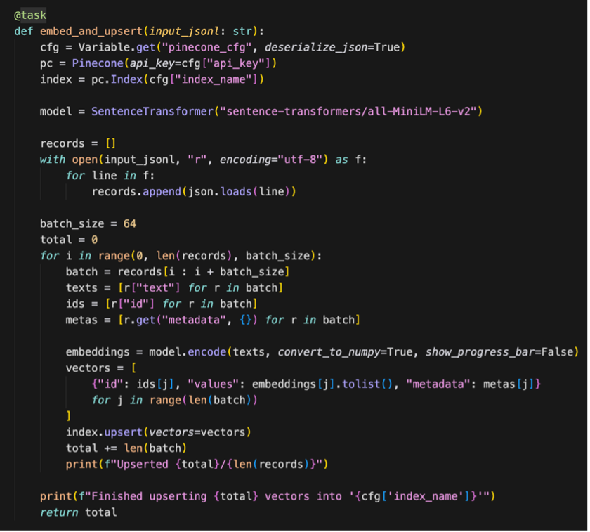

**DAG run logs showing batch processing and successful upsert:**

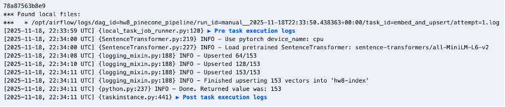

---

## Step 6: Semantic Search Task

The final task, `semantic_search`, demonstrates the power of the semantic search system. It encodes a query ("Where do Romeo and Juliet first meet?") into a 384-dimensional vector using the same MiniLM model, then queries Pinecone to retrieve the top 5 most semantically similar text chunks. The results include similarity scores and metadata, proving the entire pipeline works end-to-end.

**Task definition for semantic search:**

```python
@task
def semantic_search(query: str = "Where do Romeo and Juliet first meet?"):
    cfg = Variable.get("pinecone_cfg", deserialize_json=True)
    pc = Pinecone(api_key=cfg["api_key"])
    index = pc.Index(cfg["index_name"])
    model = SentenceTransformer("sentence-transformers/all-MiniLM-L6-v2")
    
    query_vector = model.encode([query], convert_to_numpy=True)[0].tolist()
    top_k = int(cfg.get("top_k", 5))
    results = index.query(vector=query_vector, top_k=top_k, include_metadata=True)
    
    print(f"Query: {query}  | top_k={top_k}")
    matches = results.get("matches", [])
    for i, match in enumerate(matches, 1):
        match_id = match.get("id")
        score = match.get("score")
        metadata = match.get("metadata")
        print(f"{i}) id={match_id}  score={score:.4f}  meta={metadata}")
    
    print(f"Total matches returned: {len(matches)}")
    return True
```

**Semantic search task:**

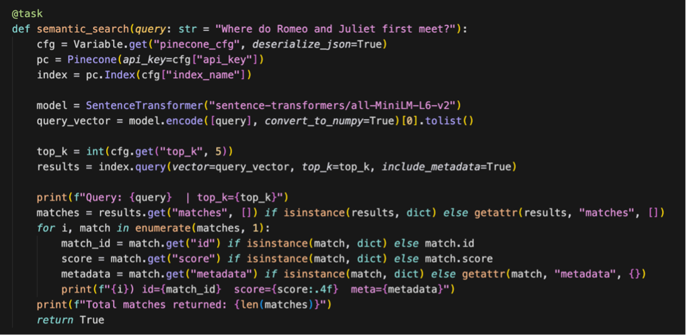

**DAG run logs showing search results with similarity scores:**

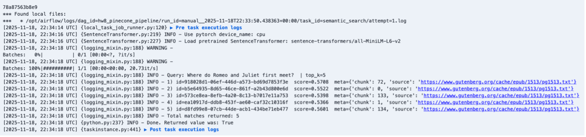

---

## Summary

This project successfully demonstrates a complete semantic search pipeline orchestrated by Apache Airflow. The DAG executed all four tasks in sequence without errors: downloading and processing text data, creating a Pinecone index, generating embeddings and upserting vectors, and performing semantic search queries. The workflow processed 154 text chunks from Shakespeare's Romeo and Juliet, generated 384-dimensional embeddings using the MiniLM model, and stored them in a Pinecone serverless index. The semantic search task validated the entire pipeline by successfully querying for relevant chunks based on meaning rather than exact keyword matches, returning accurate results with similarity scores. This demonstrates how modern data pipelines can integrate ML-powered search capabilities for unstructured data.

**Complete DAG graph showing all tasks:**

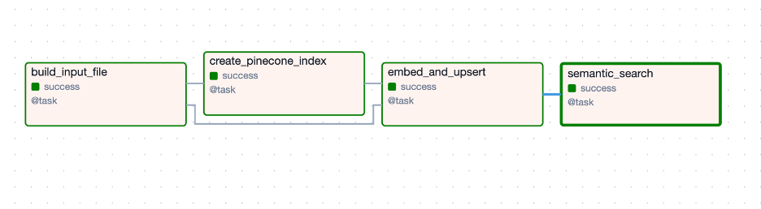

---

## Technologies Used

- **Apache Airflow 2.10.4** - Workflow orchestration with TaskFlow API
- **Pinecone** - Serverless vector database for embeddings
- **Sentence Transformers** - Text embedding generation (all-MiniLM-L6-v2 model)
- **Docker & Docker Compose** - Containerization and service orchestration
- **PostgreSQL** - Airflow metadata database
- **Redis** - Celery message broker for distributed task execution
- **Python 3.12** - Runtime environment

## Project Structure

```
Week 8/
├── airflow/
│   ├── Dockerfile                      # Custom Airflow image
│   ├── requirements.txt                # Python dependencies
│   └── dags/
│       └── hw8_pinecone_pipeline.py    # Main DAG implementation
├── dbt/
│   └── Dockerfile                      # dbt service configuration
├── screenshots/
│   ├── Picture1.png                    # Dockerfile
│   ├── Picture2.png                    # Requirements.txt
│   ├── ...                             # Additional screenshots
│   └── Picture15.png                   # DAG graph
├── docker-compose-celery.yaml          # Multi-container orchestration
├── docker-compose.yaml                 # Simplified setup
├── .gitignore                          # Git ignore rules
└── README.md                           # This file
```

## How to Run

1. **Set up environment variables:**
   ```bash
   echo "AIRFLOW_UID=$(id -u)" > .env
   echo "AIRFLOW_GID=$(id -g)" >> .env
   ```

2. **Build and start containers:**
   ```bash
   docker compose -f docker-compose-celery.yaml build
   docker compose -f docker-compose-celery.yaml up airflow-init
   docker compose -f docker-compose-celery.yaml up -d
   ```

3. **Configure Pinecone in Airflow UI:**
   - Navigate to http://localhost:8080
   - Login with `airflow` / `airflow`
   - Go to Admin → Variables
   - Add `pinecone_cfg` with your API key and configuration

4. **Trigger the DAG:**
   - Enable `hw8_pinecone_pipeline` in the Airflow UI
   - Click the play button to trigger a manual run
   - Monitor task execution in real-time

## Author

**Srinidhi Gowda**  
SJSU DATA 226 - Data Warehousing  
Fall 2025
